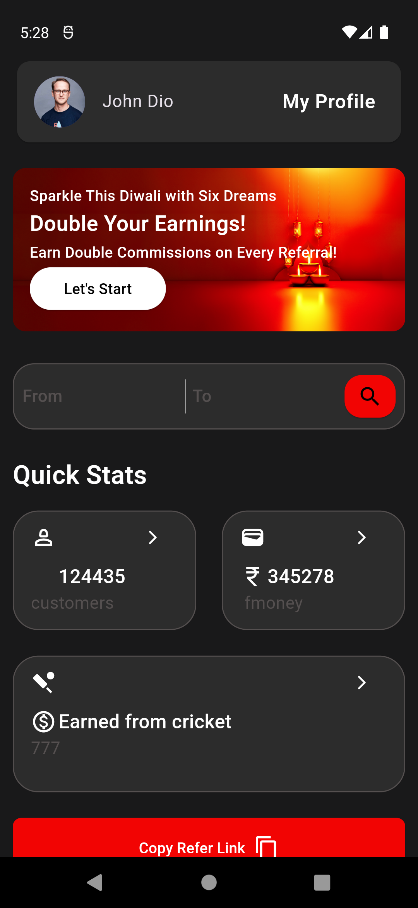
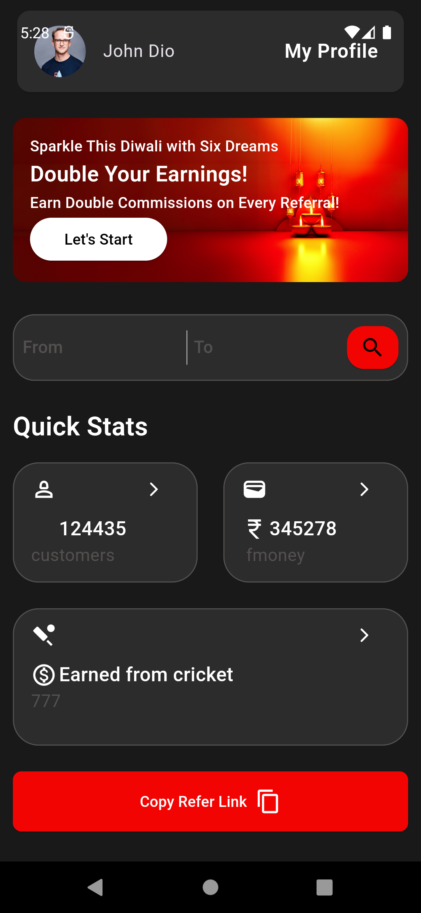
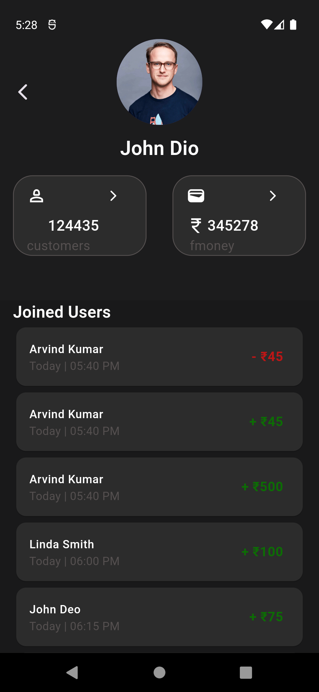
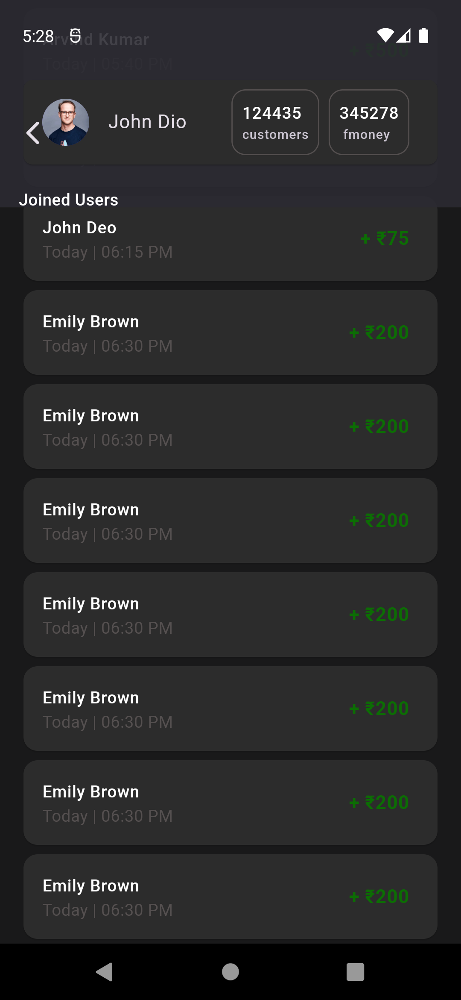

# Six Dreams Test

This is a Flutter project for the Six Dreams Test. It provides a simple dashboard and profile screen, featuring an expandable user profile widget and a smooth transition when swiping through the List of Joined Users cards.

## Getting Started

These instructions will help you set up and run the project locally.

### Prerequisites

Before you begin, ensure you have the following installed:

- Flutter SDK
- Dart SDK
- Android Studio or Visual Studio Code (with Flutter and Dart plugins)
- An emulator or a physical device for testing

### Setup

1. **Clone the Repository**:
   - Clone the repository to your local machine using the following command:
     ```bash
     git clone [Repository URL]
     ```

2. **Install Dependencies**:
   - Navigate to the project directory and run the following command to install the necessary dependencies:
     ```bash
     flutter pub get
     ```

3. **Run Code Generation**:
   - The project uses `build_runner` for code generation. Run the following command to generate the necessary files:
     ```bash
     flutter packages pub run build_runner build
     ```

4. **Run the App**:
   - Once all dependencies are installed and code generation is complete, you can run the app using:
     ```bash
     flutter run
     ```

### Development Notes

- The project follows best practices, with clear separation of constants, colors, extensions, and shared properties.
- Custom widgets and reusable components are used for a clean and maintainable UI.
- The user profile card is expandable and will smoothly transition between expanded and compressed states while swiping through the List of Joined Users cards.

### Troubleshooting

- If you encounter issues related to missing dependencies or build errors, try running the following commands:
  ```bash
  flutter clean
  flutter pub get

### ScreenShots





